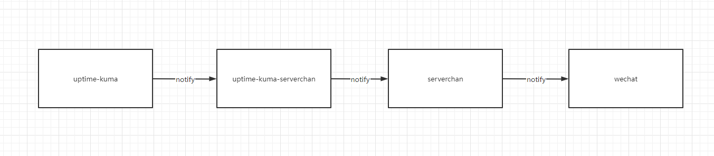
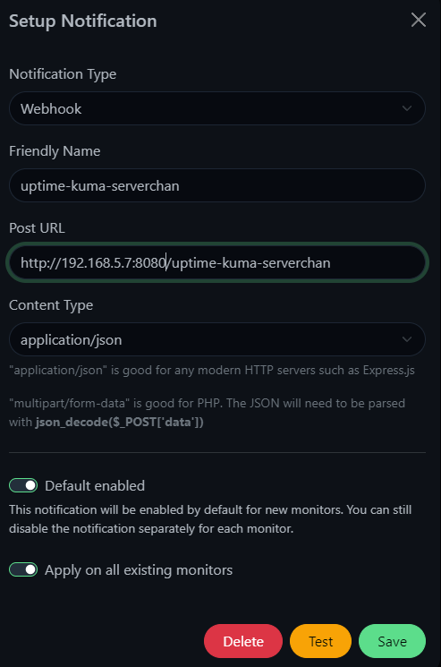

# uptime-kuma-serverchan

## Architecture

## Setup
```bash
SERVER_CHAN_SEND_KEY=<your serverchan key>
docker run -itd --name uptime-kuma-serverchan \
  --restart=unless-stopped \
  -p 8080:8080 \
  -e SERVER_CHAN_SEND_KEY=${SERVER_CHAN_SEND_KEY} \
  futuretea/uptime-kuma-serverchan:v0.0.1
```

## Uptime-Kuma notify setting

